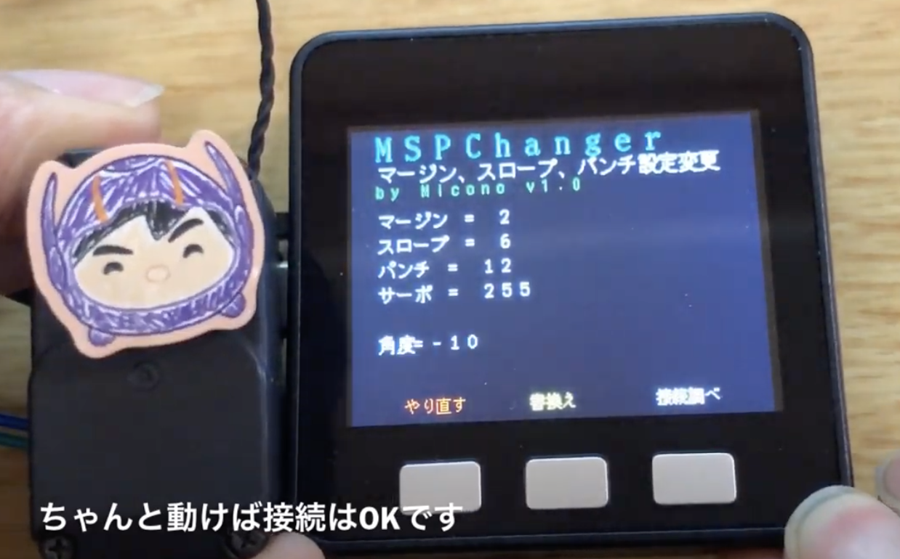

# M5Stack_RSMSPChanger

MSPChanger for M5Stackは、双葉さんのRS304系のサーボのコンプライアンスマージン、コンプライアンススロープ、パンチの設定を変更するためのM5Stackのプログラムです。このプログラムはSD-UploaderまたはLovyanLaouncherに対応していて、起動にはこれらもインストールされている必要があります。

使い方の簡単な動画は以下のURLをみて下さい。

## インストール
1. M5Stackに入れるmicroSDに、同梱のMSPChanger.binファイルをコピーして下さい。
2. FONT.BIN, FONTLCD.BINをまだ入れてない場合は、以下の手順で入れて下さい。
3. ブラウザで、https://github.com/Tamakichi/Arduino-KanjiFont-Library-SD を開きます。
4. 「Clone or download」でDownload ZIPを選び、ダウンロードする。
ダウンロードしたファイルの中に、fontbinというフォルダがあり、その中にFONT.BIN, FONTLCD.BINというファイルがあるので、これら２つのファイルをmicroSDにコピーします。

## 接続
M5Stackとサーボをジャンパーワイヤなどでつなぎます。

	M5Stack		RS304系サーボ（写真の場合上から）
	T2		…	シグナル
	5V		…	パワー
	GND		…	グランド

1. 写真のようなコネクターを作る場合は、ROBOMICのブログの[「週刊 ロビ」 RS308MD 基板側端子の入手とコネクター作成例](http://micono.cocolog-nifty.com/blog/2013/04/rs308md-f205.html)
を参考にして下さい。**ただし、この場合はサーボの情報の取得はできません。** 
 - ロビ１の基板側サーボコネクタの型番：BM03B-ACHSS-GAN-ETF(LF)(SN) [購入先例](https://www.marutsu.co.jp/pc/i/31767074/)
 - ロビ２の基板側サーボコネクタの型番：BM03B-ADHKS-GAN-ETB(LF)(SN) [購入先例](https://www.marutsu.co.jp/GoodsDetail.jsp?q=BM03B-ADHKS-GAN-ETB%28LF%29%28SN%29&salesGoodsCode=15432731&shopNo=3)
 - ＳＯＴ２３変換基板 [購入先例](http://akizukidenshi.com/catalog/g/gP-03660/)
 - 分割ロングピンソケット [購入先例](http://akizukidenshi.com/catalog/g/gC-05779/)

2. **M5Stack RSTester専用アンダプターについて**
	- サーボ情報を取得するためには半２重回路にしなくてはいけません。M5Stackに簡単に付けて使えるアダプタを設計しました。アダプターは２種類あり、黒いアダプタと赤いアダプタがあります（図）。
	- 黒いアダプターは、M5Stackの右側面のGPIOに挿して使います（図）。
	- 赤いアダプターは、FireなどのGROVE UARTのコネクタをつなげて使います（図）。

それぞれのアダプターが対応している、M5STack, サーボは、以下の通りです。

	アダプター	　M5Stack				　サーボ
		黒	…	BASIC,GRAY				RS303SR,RS304MD, ロボゼロ, ロビ１、ロビ２
		赤	…	BASIC,GRAY,FIRE,M5GO	ロビ１、ロビ２

回路図：

パーツ：

 - ロビ１の基板側サーボコネクタの型番：BM03B-ACHSS-GAN-ETF(LF)(SN) [購入先例](http://d.digikey.com/qKKS070KNe1p3YL0X0d800K)
 - ロビ２の基板側サーボコネクタの型番：BM03B-ADHKS-GAN-ETB(LF)(SN) [購入先例](http://d.digikey.com/qKKS070KNf1p3YL0X0d900K)
 - 3ステートバッファーIC SN74LV4T125PWR / 74??125?などなど [購入先例](http://d.digikey.com/o00ap00gY10KdSL3KKX7KN0)
 - 抵抗 100Ω (1608)
 - 抵抗 1kΩ (1608)
 - コンデンサー 0.1µF (1608) [購入先例](http://akizukidenshi.com/catalog/g/gP-05621/)
 - GROVE用-4Pコネクタ Ｌ型（オス）[購入先例](http://akizukidenshi.com/catalog/g/gC-12634/)
 
**M5Stack RSTester専用アンダプターに関してのご質問、ご希望等は、miconoまで、問い合わせください。**

## MSPChangerを起動
SD-Menu (SD-Uploader)からRSMSPChangerを選択して起動させて下さい。 
まだ入れてない方は以下の手順でドライバーや、SD-Menuをインストールして下さい。

### USBドライバーをインストールする
M5Stackをコンピュータと繋いで、プログラムの転送など通信するためには、Silicon LabsのUSBDriverをインストールする必要があります。もしまだインストールしてなければ
[シリアル接続の確立方法](https://docs.m5stack.com/#/ja/related_documents/establish_serial_connection)
のサイトを参考にしてインストールして下さい。

> なお、Macの場合、インストールしただけではセキュリティが通ってないので、インストール後、環境設定のセキュリティとプライバシーの一般で、インストールしたドライバーの許可をして下さい。
> 

### M5Burner_Micで、M5StackにSD-Menuをインストールする
"M5Burner\_Mic"というプログラムでSD-MenuをM5Stackにインストールします。すでにSD-MenuまたはLovyanLauncherをインストールしてある場合はこのステップは必要ありません。

1. [M5Burner_Mic](https://github.com/micutil/M5Burner_Mic) のページから「Download [here](http://micutil.com/download/M5Burner_Mic.zip)」の所でM5Burner\_Micをダウンロードし、解凍して下さい。M5Burner\_Micフォルダはお好みの場所に入れて下さい。
2. M5Stackに付いてきたUSB-CケーブルでパソコンとM5Stackを繋げて下さい。
3. M5Burner\_Micをダブルクリックして起動します。
4. USBシリアルポートをM5Stackのポートに設定します。
 - Macの場合はポートに名前がつくので「**SLAB_USBtoUART**」という名前のポートを選んで下さい。
 - Windowsの場合は、**COM3**とか、COM4とかの名前になっています。ひとつしか表示されてなかったら、それがM5Stackのポートでしょう。もしいくつか表示されているようだったら、コントロールパネルから、デバイスマネージャーのポートをみて番号を確認して下さい。例えば以下の図の場合だと**COM4**であるということになります。 
5. 「Priset」のポップアップメニューで「**SD-Menu**」の最新版を選択します。
6. 「**Start**」ボタンをクリックすると、プログラムの転送が開始します。
7. プログラムの転送が終わるとM5Stackがリセットされ、インストールした**SD-Menu**が起動します。
8. メニューからRSMSPChangerを選択して、起動させます。

## 設定変更
コンプライアンスマージン、コンプライアンススロープ、パンチ、サーボのIDの順で設定していきます。MSPChangerが起動し、両端のボタンで設定値を変えて、真ん中のOKボタンを押すと、次、次と、設定項目が変更していきます。
IDは255を選ぶと、全てのサーボが対象になりますので、複数のサーボがつながっているサーボすべて同じ値に変更する時や、サーボのIDがわからない場合は、255を選ぶといいでしょう。

サーボIDまで設定が進むと、次にボタンが、「やり直し」、「書換え」、「接続調べ」に変わります。設定をもう一度やり直したい場合は、「やり直し」を押して最初から設定し直して下さい。

#### 接続テスト
「接続調べ」を押すとサーボが10度ごと回転しますので、正しく接続されていてサーボが動くか確認して下さい。

#### 変更を保存
設定値は変更しただけで、ROMに書き込まれていませんので、「書換え」ボタンを押して書き換えを行って下さい。この時に電源が切れるとサーボが壊れるかもしれませんのでちゃんと電源を接続して行って下さい。

## 問い合わせ

同梱されている書類すべてに関して、無断転載、掲載、改変を禁じます。
これらを使ったことにより生じるいかなるトラブルに関しても自己責任においておこなって下さい。
